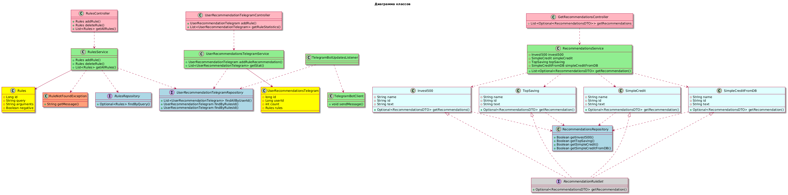

# Проект: CommandWorkGroup3 

Описание:
Этот проект представляет собой приложение для выдачи рекомендаций пользователям банковскими продуктами, через сайт и telegram-bot.

Проект разработан на языке Java с использованием: Spring Boot, Hibernate, Maven, JPA.

## Архитектура проекта

Проект следует архитектуре MVC (Model-View-Controller) и состоит из следующих основных компонентов:

### 1. Модель (Model)
Модель представляет собой слой данных и бизнес-логики приложения. В проекте используются следующие классы модели:

**UserRecommendationTelegram.java:**  Представляет сущность "Рекомендация через Telegram" с полями id, userId, count.

**Rules.java:**  Представляет сущность "Правила" с полями id, query, argumtnts, negate.

Модель использует ORM (Object-Relational Mapping) для взаимодействия с базой данных. В проекте используется Hibernate для этой цели.

### 2. Контроллеры (Controller)
Контроллеры отвечают за обработку входящих HTTP-запросов и возвращение соответствующих ответов. Основные контроллеры проекта:

**GetRecommendationsController.java:**  Обрабатывает запросы, связанные с задачами получения рекомендаций по продуктам банка.

**RulesController.java:** Обрабатывает запросы, связанные с задачами создания удаления и получения всех правил.

**UserRecommendationTelegramController.java:**  Обрабатывает запросы, связанные с задачами выдачи рекомендаций ползователям через Telegram.

Контроллеры используют сервисы для выполнения бизнес-логики и взаимодействия с моделью.

### 3. Сервисы (Service)

Сервисы содержат бизнес-логику приложения и выполняют операции над данными, предоставляемыми репозиториями. Основные сервисы проекта:

**Invest500.java:**  Предоставляет методы для получения рекомендаций по продукту Invest500.

**TopSaving.java:**  Предоставляет методы для получения рекомендаций по продукту TopSaving.

**SimpleCredit.java:**  Предоставляет методы для получения рекомендаций по продукту SimpleCredit.

**SimpleCreditFromDB.java:**  Предоставляет методы для получения рекомендаций по продукту SimpleCreditFromDB из базы данных.

**RecommendationsService.java:**  Предоставляет методы для получения рекомендаций по всем продуктам банка.

**TelegramBotClient.java:**  Предоставляет методы для выдачи рекомендаций через Telegram-bot.

**UserRecommendationsTelegramService.java:**  Предоставляет методы для получения всех рекомендаций и статистики по выдаче рекомендаций пользователям.

**RulesService.java:**  Предоставляет методы связанные с задачами создания удаления и получения всех правил.

Сервисы используют репозитории для доступа к данным.

### 4. Репозитории (Repository)

Репозитории отвечают за взаимодействие с базой данных. В проекте используются интерфейсы репозиториев, которые расширяют JpaRepository для автоматической реализации CRUD-операций. Основные репозитории:

**RecommendationsRepository.java:**  Предоставляет методы выдачи рекомендаций пользователям по продуктам - Invest500, TopSaving, SimpleCredit, SimpleCreditFromDB.

**RulesRepository.java:**  Предоставляет методы для работы с правилами в базе данных.

**UserRecommendationTelegramRepository.java:**  Предоставляет методы для работы с рекомендациями в базе данных.

### 5. Конфигурация (Configuration)
Конфигурация проекта находится в классе RecommendationsDataSourceConfiguration.java, который содержит настройки для Spring контекста, базы данных, безопасности и других компонентов.

### 6. Зависимости
Проект использует следующие основные зависимости:

**Spring Boot:**  Фреймворк для упрощения создания приложений на Java.

**Spring Data JPA:**  Для работы с базой данных через JPA.

**Hibernate:**  ORM для работы с базой данных.

### Диаграмма классов

### Установка и запуск

Клонируйте репозиторий:

bash
Copy code
git clone https://github.com/BlackSwanXQ/CommandWorkGroup3/CommandWorkGroup3.git

Перейдите в директорию проекта:

bash
Copy code
cd CommandWorkGroup3

Соберите проект с помощью Maven:

bash
Copy code
mvn clean install

Запустите приложение: 

bash
Copy code
mvn spring-boot:run
Откройте браузер и перейдите по адресу http://localhost:8080.

### Тестирование

Для тестирования проекта используются JUnit и Mockito. Тесты находятся в директории src/test/java.

Авторы: Шлапаков Алексей, Станислав Тюльков, Андрей Христюк, Новожилов Владислав.

Email: theblack2swan@gamil.com

GitHub: https://github.com
